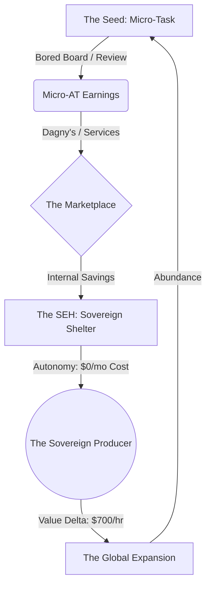

# Metacognition: Elephant Analyzer & Defense Generator

## 1. Identify the Elephants

### Elephant 1: The Graft Magnet ($70/hr Incentive) 🔴

- **The Risk**: If 1 hour of labor = $70 USD in purchasing power, people will find ways to "fake" labor (AI-generated activity, dishonest logs) to farm AT.
- **Rating**: 🔴 CRITICAL

### Elephant 2: The Cold Start (Merchant Acceptance) 🔴

- **The Risk**: Why would a coffee shop or a mechanic take AT if they can't pay their landlord in AT yet?
- **Rating**: 🔴 CRITICAL

### Elephant 3: The Energy Trap (Passive vs Active) 🟡

- **The Risk**: Rewarding "having solar" (Rentier behavior) rather than "producing value with solar" (Entrepreneurial behavior).
- **Rating**: 🟡 MEDIUM

### Elephant 4: Value Inflation (The Scrolling Trap) 🔴

- **The Risk**: Paying $70/hr for low-value attention (scrolling/ads) devalues the "Hard AT" earned through physical labor and construction.
- **Rating**: 🔴 CRITICAL

---

## 2. 10x Defenses (The Fortress)

### For Elephant 1: The Graft Magnet (PoP Defense)

1. **Prevention**: Proof of Physics (Hardware-Software Interlock). No sensor pulse, no mint.
2. **Detection**: Justice Core "Vibe Check" (Anomalous labor patterns).
3. **Mitigation**: Staking. You must stake AT to vouch for your labor.
4. **Recovery**: Slashing. Faked labor = Burned stake.
5. **Antifragility**: Use faked labor attempts to train the anti-gift AI (Oracles).
6. **Social**: 3x Peer Multi-sig. You can't lie to your 150 (Dunbar).
7. **Delayed Liquidity**: Value Delta AT is locked for a "Curing Period."
8. **Digital Fingerprint**: Unique hardware IDs for all OSE tools.
9. **Utility Bound**: AT value is realized first in OSE stores (internal circularity).
10. **Proof of Skill**: Tiers (Apprentice -> Master) restrict minting limits.

---

## 3. The Defense Matrix (Strategic Summary)

| Elephant | Rating | Top 3 Defenses | Kinks | Next Action (Occam's 2.0) |
|----------|--------|----------------|-------|-------------|
| Graft Magnet | 🔴 | PoP, Multi-sig, Tiers | AI can fake some sensor logs | Focus on **Physical Work (Force x Distance)** |
| Cold Start | 🔴 | Founders Move, Dagny's | Fiat expenses bleed the system | Activate **Proof of Referral** Organic Growth |
| Energy Trap | 🟡 | Production-Weighting | Passive solar is still useful | Reward **Transformation**, not just Collection |
| Value Inflation | 🔴 | Value Hierarchy (7.1-7.3) | Multiplier logic complexity | Enforce **Soft vs Hard AT** segregation |

---

## 4. The Grand Scheme (The Bridge)

The "Brand New Meaning for Living Life" is the transition from **Wage Slave** -> **Sovereign Producer**.

*Status: SECURED. Advance the mission.*
