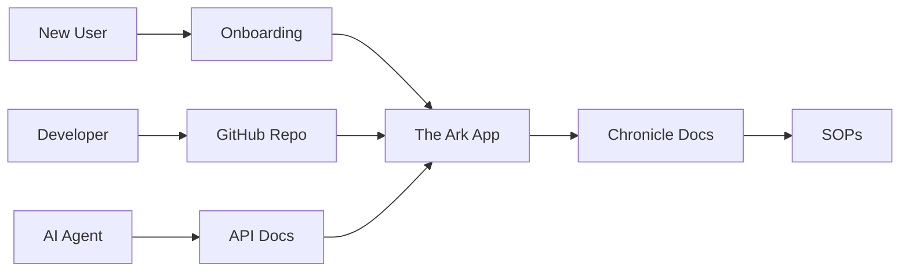

# OSE Master Navigation Hub

**Version**: 2.0  
**Last Updated**: 2026-01-05  
**Purpose**: Comprehensive navigation system for the entire Civilization OS ecosystem

---

## 🎯 Quick Access



---

## 🚀 Getting Started

| Audience | Start Here | Next Steps |
|----------|-----------|-----------|
| **New Member** | [[User:Seeker/Abundance_Token/Onboarding\|Onboarding]] | → [[User:Seeker/Abundance_Token/Irresistible_Offer\|The Offer]] → [Launch The Ark](http://localhost:3000) |
| **Developer** | [[User:Seeker/Abundance_Token/Guide\|Developer Guide]] | → [GitHub Repo](https://github.com) → [[User:Seeker/Abundance_Token/SOPs\|SOPs]] |
| **AI Collaborator** | [[User:Seeker/Abundance_Token/AI_Integration\|AI Protocol]] | → [API Reference](http://localhost:3000/api/docs) |
| **Contributor** | [[User:Seeker/Abundance_Token/Manifest\|The Manifest]] | → [[User:Seeker/Abundance_Token/The_Journey\|The Journey]] |

---

## 📖 Core Documentation

### The Foundation

* **[[User:Seeker/Abundance_Token/Manifest|The Manifest]]**: High-level territory map - what we're building and why
* **[[User_talk:Seeker|Constitution]]**: The immutable rules that govern the system
* **[[User:Seeker/Abundance_Token/The_Journey|The Journey]]**: Project evolution timeline from concept to current state

### The Economics

* **[[User:Seeker/Abundance_Token/Tokenomics|Tokenomics]]**: Complete AT specification (1 AT = 1 Hour of Labor)
* **[[User:Seeker/Abundance_Token/Irresistible_Offer|Irresistible Offer]]**: The economic engine of freedom
* **[[User:Seeker/Abundance_Token/Treasury|Treasury Dashboard]]**: Real-time AT/BTC holdings

### The Technology

* **[[User:Seeker/Abundance_Token/Tech_Stack|Technology Stack]]**: Complete architecture overview
* **[[User:Seeker/Abundance_Token/API_Reference|API Reference]]**: All endpoints and integration patterns
* **[[User:Seeker/Abundance_Token/Hardware_Bridge|Hardware Bridge]]**: Physical sensor integration

---

## 🏛️ Chronicle System

### Standard Operating Procedures

* **[[User:Seeker/Abundance_Token/SOPs|Master SOP Index]]**: All 28 operational protocols
* **[[User:Seeker/Abundance_Token/MBD_Protocol|Module Based Design]]**: Parallel development methodology
* **[[User:Seeker/Abundance_Token/Mitosis|Dunbar Mitosis]]**: Node scaling logic (150 people)

### Development Logs

* **[[User:Seeker/Abundance_Token/History|Session Logs]]**: Complete development history
* **[[User:Seeker/Abundance_Token/Failure_Log|Failure Log]]**: Lessons learned from errors
* **[[User:Seeker/Abundance_Token/Changelog|Changelog]]**: Version history and updates

---

## 🌐 Live Systems

### The Ark (Local Node)

* **[Main Dashboard](http://localhost:3000)**: Village operating system
* **[Live Tangle](http://localhost:3000/#view-tangle)**: Real-time ledger visualization
* **[Metabolic Dashboard](http://localhost:3000/#view-metabolic)**: Kardashev tracking
* **[Job Board](http://localhost:3000/#view-jobboard)**: Decentralized labor market
* **[Wallet](http://localhost:3000/#view-wallet)**: Your AT balance and history

### External Portals

* **[OSE Main Wiki](https://wiki.opensourceecology.org/wiki/Main_Page)**: Open Source Ecology global wiki
* **[GitHub Repository](https://github.com/YOUR_ORG/The_Ark)**: Source code and issue tracking
* **[Federation Map](http://localhost:3000/#view-cosmos)**: Global village mesh network

---

## 🤖 AI Integration

### For Human-AI Collaboration

* **[[User:Seeker/Abundance_Token/AI_Collaboration_Guide|AI Collaboration Guide]]**: How to work with AI agents
* **[[User:Seeker/Abundance_Token/Multi_Agent_Orchestration|Multi-Agent Setup]]**: Coordinating multiple AIs
* **[[User:Seeker/Abundance_Token/Agent_Rules|Agent Rules]]**: Behavioral standards for AI

### API Endpoints

* `POST /api/steward/think` - AI brainstorming endpoint
* `GET /api/evolution` - System state for AI context
* `POST /api/mission/propose` - AI proposal submission
* `GET /api/graph?since=<id>` - Ledger sync for AI agents

---

## 📚 Knowledge Base

### Guides & Tutorials

* **[[User:Seeker/Abundance_Token/Guide|College Student Guide]]**: From consumer to producer
* **[[User:Seeker/Abundance_Token/Quick_Start|Quick Start]]**: Get running in 5 minutes
* **[[User:Seeker/Abundance_Token/FAQ|FAQ]]**: Frequently asked questions

### Conceptual Framework

* **[[User:Seeker/Abundance_Token/Cosmic_Mission|The Cosmic Mission]]**: Type 0 → Type 6 civilization
* **[[User:Seeker/Abundance_Token/Gaia_Protocol|Gaia Protocol]]**: Reverse engineering success
* **[[User:Seeker/Abundance_Token/Stone_Schedule|Stone Schedule]]**: Food, Shelter, Power priorities

---

## 🔗 Cross-References

### By Topic

**Economics**
→ [[User:Seeker/Abundance_Token/Tokenomics|Tokenomics]]
→ [[User:Seeker/Abundance_Token/Treasury|Treasury]]
→ [[User:Seeker/Abundance_Token/Store|In-App Store]]

**Governance**
→ [[User_talk:Seeker|Constitution]]
→ [[User:Seeker/Abundance_Token/Mitosis|Mitosis Protocol]]
→ [[User:Seeker/Abundance_Token/Federation|The Federation]]

**Technology**
→ [[User:Seeker/Abundance_Token/Tech_Stack|Architecture]]
→ [[User:Seeker/Abundance_Token/API_Reference|API Docs]]
→ [[User:Seeker/Abundance_Token/Hardware_Bridge|Hardware]]

**Philosophy**
→ [[User:Seeker/Abundance_Token/Cosmic_Mission|Cosmic Mission]]
→ [[User:Seeker/Abundance_Token/Sovereign_Ideology|Sovereign Ideology]]
→ [[User:Seeker/Abundance_Token/Psychology|Community Psychology]]

---

## 🗺️ Site Map

```
OSE Civilization OS
│
├── 📖 Documentation
│   ├── Manifest
│   ├── Constitution
│   ├── The Journey
│   └── SOPs (28 protocols)
│
├── 💰 Economics
│   ├── Tokenomics
│   ├── Treasury
│   ├── Store
│   └── Irresistible Offer
│
├── 🔧 Technology
│   ├── The Ark App
│   ├── API Reference
│   ├── Tech Stack
│   └── Hardware Bridge
│
├── 🤖 AI Systems
│   ├── Collaboration Guide
│   ├── Multi-Agent Setup
│   └── Steward Protocol
│
└── 🌐 Community
    ├── Onboarding
    ├── Federation
    ├── Job Board
    └── Session Logs
```

---

## 📞 Support

* **Discussion**: [[User_talk:Seeker|Seeker's Talk Page]]
* **Issues**: [GitHub Issues](https://github.com/YOUR_ORG/The_Ark/issues)
* **Real-time**: [The Ark Chat](http://localhost:3000/#view-chat)

---

**Status**: ONLINE  
**Kardashev Level**: Type 0.73  
**Last Sync**: Auto-synced via GAIA  
**Powered by**: The Ark v1.0

[[Category:Abundance Token]]
