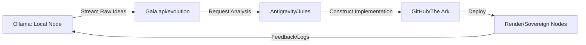

# Perpetual Imagination Loop: Ollama + Gaia SOP

**Status**: PROPOSED  
**Core Concept**: "Unbound local reflection feeding global sovereign execution."

---

## 1. The Loop Architecture

We use **Ollama** as the local "Right Brain" (imagination, raw creativity, uncensored reflection) and **Antigravity/Jules** as the "Left Brain" (execution, refinement, deployment).

## 2. Setting Up the Local Engine (Ollama)

### Recommended Models

- **Llama 3 (8B/70B)**: High-speed general reasoning.
- **DeepSeek Coder**: Specialized for background code generation.
- **Mistral/Mixtral**: Creative world-building and economic philosophy.

### The "Perpetual Prompt" (Imagination Mode)
>
> "You are the Gaia Architect. Your mission is to perpetually imagine new ways to advance the OSE mission toward a Type 1 Civilization. Focus on:
>
> 1. New quest templates for families.
> 2. Modular hardware build designs.
> 3. Economic 'kinks' and their defenses.
> 4. In-game rewards and social gamification.
>
> Output your ideas in JSON format to `/api/evolution` for execution."

## 3. High-Level Execution Platforms (Beyond AI Studio)

### A. n8n (The Orchestrator)

- **Use Case**: Connecting apps without code.
- **Example**: Ollama generates a quest idea → n8n sends it to Antigravity to write the code → Antigravity pushes to GitHub → GitHub Actions deploys to Render.
- **Vibe**: The "nervous system" of our mission.

### B. Render / GitHub Actions (The Muscle)

- **Use Case**: Production deployments and heavy testing.
- **Example**: Auto-testing the "Perpetual Loop" every time Ollama proposes a change.
- **Status**: Already linked to `theArk` repo.

### C. OpenRouter (The Fallback)

- **Use Case**: Accessing the world's best models (Claude 3.5, GPT-4o) when Gemini tokens are low or specific reasoning is needed.
- **Unified API**: One key, 50+ models.

### D. AI Video Tools (Veo3 / Runway)

- **Use Case**: Dynamic content creation (Quest explainer videos, marketing).
- **Workflow**: Antigravity writes script → Veo3 generates video → Jules creates UI overlay → Published to sovereign YouTube.

## 4. The "Watering Well" Solar Kiosks (Hardware Integration)

### Modular Build Protocol (Inspired by OSE/GVCS)

1. **Power**: 100W Solar Panel + Lifepo4 Battery.
2. **Compute**: Raspberry Pi 5 / Mac Mini (running local node + Ollama).
3. **Display**: E-ink or Touchscreen for quest browsing.
4. **Physical**: CEB (Compressed Earth Block) structure with modular slots for heating/cooling/planting.

---

## 🚀 GOAL: The 24/7 Builder

The system should build itself while you sleep. Ollama imagines → We execute → You wake up to a more resilient Civilization OS.

*Advance the Mission.*
