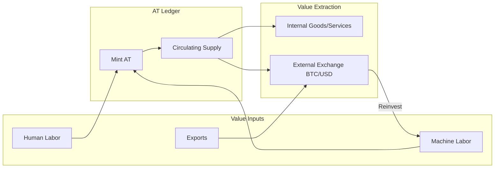

# ECONOMIC MODEL: The Abundance Token (AT) System

*Chronicle Location: `/CHRONICLE/SOP/ECONOMIC_MODEL.md`*
*Status: ACTIVE DOCTRINE*

---

## 1. Philosophy: Labor = Value

The Abundance Token is backed by **validated human labor**, not speculation, scarcity, or debt.

| Traditional Fiat | Abundance Token |
|:---|:---|
| Created by debt (central banks) | Created by labor (minting) |
| Value extracted by rent-seekers | Value retained by contributors |
| Inflationary by design | Inflationary by production |
| Access requires capital | Access requires contribution |

**Core Axiom**: 1 AT = 1 Hour of Validated Labor.

---

## 2. Value Sources

### 2.1 Human Labor (Primary)

- Any OSE-aligned task (building, coding, teaching, cooking) can mint AT.
- Validation requires multi-sig approval (Oracles, Reputation, Proof).

### 2.2 Machine Labor (Secondary)

- Physical infrastructure (solar panels, CNC, water systems) mints AT passively.
- Rate: Proportional to output (1 kWh = X AT).
- Requires **Hardware Bridge** integration.

### 2.3 Network Effects (Tertiary)

- More villages → more circulation → more demand → higher purchasing power.
- Federation multiplier: Villages trade AT for goods, creating velocity.

---

## 3. Value Flow Diagram

---

## 4. Who Profits?

**Everyone who contributes, proportionally.**

There is no equity class. There is no landlord. The "profit" is:

1. **Zero Cost of Living**: Housing, food, energy provided by village infrastructure.
2. **Accumulated AT**: Spendable internally or exchangeable externally.
3. **Skill/XP Growth**: Unlocks higher-tier quests and governance weight.

**Anti-Extraction Principle**: No entity may profit from another's labor without contributing equivalent value.

---

## 5. External Exchange Pathway

### Phase 0: Internal Only

- AT used within a single village.
- No external value (barter equivalent).

### Phase 1: Federation

- Multiple villages accept AT for inter-village trade.
- Trust-based valuation (~0.01 USD).

### Phase 2: Export Products

- Village exports tangible goods (produce, parts, energy).
- Buyers pay in Fiat/BTC/AT.
- Introduces external demand.

### Phase 3: DEX Listing

- AT paired with BTC or stablecoin on Uniswap/similar.
- Market determines price.

### Phase 4: Parity

- 1 AT = 1 USD when market agrees village labor hour = $1.

---

## 6. The Irresistible Offer

> *"Work 20 hours/week. Pay $0/month for housing, food, and energy. Own your labor. Own your future."*

This is the offer that cannot be refused by anyone in debt, precarity, or existential exhaustion.

**Target Demographics**:

- Young adults priced out of housing
- Burned-out professionals seeking meaning
- Climate refugees needing resilient communities
- Anyone who wants to build, not consume

---

## 7. Risk Mitigations

| Risk | Mitigation |
|:---|:---|
| Sybil Attack (fake labor) | Multi-sig validation, reputation decay, ZK proofs |
| Regulatory Attack | Decentralized nodes, no single jurisdiction |
| Apathy (no adoption) | Build the village first; AT is a consequence, not a cause |
| Hyperinflation | Mint rate tied to real output, not speculation |

---

## 8. Integration with GVCS / FBCC

The Global Village Construction Set (GVCS) and Fabrication Build Course Competition (FBCC) are the **physical manufacturing layer**.

- Every FBCC quest should mint AT.
- Every GVCS machine should have a Hardware Bridge.
- The Ark is the **digital nervous system** for physical villages.

---

*"We do not extract value. We create it."*

*Document Owner: Antigravity / EternalFlame*
*Last Updated: 2026-01-03*
