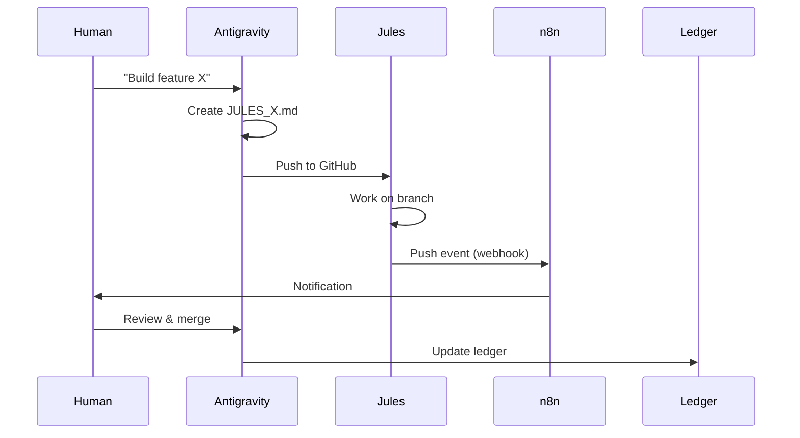

# MULTI-AGENT ORCHESTRATION PROTOCOL

*Chronicle Location: `/CHRONICLE/SOP/MULTI_AGENT_ORCHESTRATION.md`*
*Status: ACTIVE DOCTRINE*

---

## 1. Agent Roster

| Agent | Role | Communication | Trigger |
|:---|:---|:---|:---|
| **Antigravity (Cursor)** | Orchestrator, Architect | Real-time IDE | Human command |
| **Jules (Google)** | Async Coder | GitHub commits/PRs | `JULES_*.md` files |
| **n8n** | Automation Engine | Webhooks, API | Cron/Events |
| **Ollama** | Sovereign LLM | Local API | n8n or direct |

---

## 2. Delegation Protocol

### To Jules (Async GitHub Work)

1. Create `JULES_[MISSION_NAME].md` in repo root
2. Include: Objective, Deliverables, Constraints, Success Criteria
3. Push to GitHub
4. Jules picks up and creates branch `jules/[mission]`
5. Monitor via n8n webhook → notification

**Current Jules Missions:**

- ✅ `JULES_ONBOARDING.md` - Phase 1 complete (tests created)
- 🔄 `JULES_LIGHTNING_BRIDGE.md` - Awaiting pickup

### To n8n (Automations)

Workflows are JSON files in `/n8n_workflows/`.
Import via n8n UI.

---

## 3. Active Automations

| Workflow | Trigger | Action |
|:---|:---|:---|
| `github_jules_monitor` | GitHub webhook (push) | Notify on Jules commit |
| `hardware_mint` | Cron every 5 min | Poll sensors → mint AT |
| `chronicle_backup` | Cron daily 3am | Export ledger to markdown |
| `steward_evolution` | Cron every 6 hours | AI proposes next mission |

---

## 4. n8n Webhook Endpoints

| Endpoint | Purpose |
|:---|:---|
| `POST /webhook/github` | Receives GitHub push events |
| `POST /webhook/hardware` | Manual sensor trigger |
| `GET /webhook/health` | n8n status check |

---

## 5. ROI Estimation: Token Budget

### Cost per Agent Hour

| Agent | Cost | ROI Multiplier |
|:---|:---|:---|
| Antigravity (Cursor Pro) | ~$20/month | 10-50x (saves hours/day) |
| Jules (Free tier) | $0 | ∞ (async = free labor) |
| n8n (Self-hosted) | $0 | ∞ (automation compounds) |
| Ollama (Local) | $0 | ∞ (sovereign, no API cost) |

### Investment to First Dollar

| Budget | Timeline | Expected Return |
|:---|:---|:---|
| $0 (pure labor) | 12-18 months | First AT ↔ BTC swap |
| $500 (hardware + hosting) | 6-12 months | Faster iteration |
| $2000 (dedicated server + sensors) | 3-6 months | Hardware Bridge live |

**ROI Formula:**

```
ROI = (Hours Saved × Hourly Rate) / (Token Cost + Infrastructure)
```

Example: If Cursor saves 4 hours/day × $50/hr = $200/day saved.
$20/month = **300x ROI**.

---

## 6. How Agents Communicate



---

## 7. File Locations

| File | Purpose |
|:---|:---|
| `/n8n_workflows/*.json` | Importable n8n workflows |
| `/JULES_*.md` | Mission specs for Jules |
| `/CHRONICLE/SOP/` | Doctrine and protocols |

---

*"Many hands make light work. Many agents make sovereign work."*

*Document Owner: Antigravity / EternalFlame*
*Last Updated: 2026-01-03*
