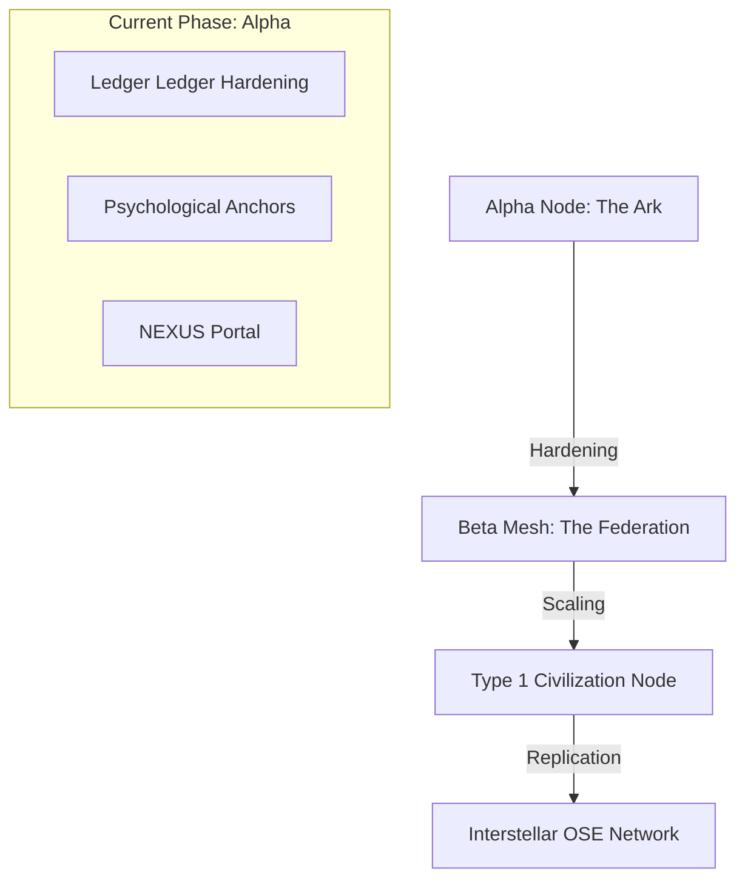

# Roadmap 001: The Cosmic Descent (Phase Alpha to Type 1)

> [!IMPORTANT]
> **The Objective**: To build a technical and biological system that renders the cost of living $0/month while maximizing human potential. We are not building an "App"; we are building a **Civilization Bootloader**.

## 1. The Strategy: Recursive Sovereignty

We build backward from the **End State**: 150 happy people, 100% self-sufficient, 100% morale.

## 2. The Four Pillars of Abundance

To achieve the goal, every node must master these dimensions:

| Pillar | Current Progress | Next Milestone |
| :--- | :--- | :--- |
| **Information** | Ark OS v1.0, Oracle Hardening | **The Librarian**: Automated Wiki-to-Action sync. |
| **Energy** | Manual Tracking | **The Grid**: Direct sensor-to-AT minting of Solar Yield. |
| **Biology** | Grounding UI, Time Movie | **The Harvester**: Real-time greenhouse/soil telemetry. |
| **Logic** | n8n Blueprints | **The Steward**: Autonomous node maintenance agents. |

## 3. The Path Ahead (The "Now")

### Phase 12: Economic Circularity (Mycelium)

- **Problem**: AT is earned but hard to spend on external goods.
- **Solution**: The **Mycelium Store**. A p2p marketplace where villagers trade AT for internal items (Food, Tools, Bed) and use a built-in **BTC Bridge** for external trade.

### Phase 13: One-Click Boot (The Spore)

- **Problem**: Sharing OSE with the community is manual and difficult.
- **Solution**: **The Spore Protocol**. A single Docker/ISO image that converts any Mac/Linux machine into a fully functional OSE Node in 5 minutes.

### Phase 14: Visual Mastery (The Bridge)

- **Problem**: The UI feels like a "Dashboard" rather than a "Starship".
- **Solution**: **The Bridge UI**. A cinematic, high-density visualization of node health that makes the "Invisible" (Energy, Soil, Mesh) visible.

---

## 4. How We Share with the Whole

Every node you boot, every bug we fix, and every SOP we write is automatically pushed to the **Global Mycelium Sync**.

1.  **Open Source Replication**: Your code is the blueprint. Anyone can fork it and start their own village.
2.  **Shared Intelligence**: As you train your local LLM, we can export "Anonymized Intelligence Graphs" that help other nodes solve similar problems (e.g., "The Missouri Soil Patch").
3.  **Abundance Federation**: Nodes don't compete; they federate. If your node has a surplus of Water (translated to AT), you can trade with a node that has a surplus of Solar Energy.

---
*Status: UNIVERSAL MISSION ACTIVE*
