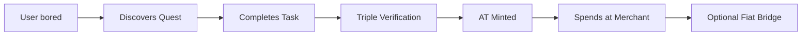

# 🚀 The Ark - Developer Overview

> **Welcome, Builder.** This is your complete guide to understanding and contributing to The Ark Civilization OS.

**Last Updated**: January 6, 2026  
**Status**: ✅ OPERATIONAL | Kardashev Type 0.73

---

## 🎯 Mission Statement

The Ark is a **self-sovereign village operating system** that enables communities of up to 150 people to achieve absolute survival sovereignty via:

1. **Abundance Tokens (AT)** - Labor-backed currency where 1 AT = 1 Hour of Validated Labor
2. **Federated Mesh** - Dunbar-limited nodes (150 people) connected peer-to-peer
3. **AI Collaboration** - Multi-AI governance (Gemini, Jules, Ollama)

**Goal**: Transition humanity from Type 0.7 → Type 6 Civilization

---

## 🏗️ System Architecture

```
The_Ark/
├── server.py              # 🎯 Main entry point (lean controller)
├── core/                  # 🧠 Core business logic (27 modules)
├── api/                   # 🔌 REST API endpoints (13 modules)
├── web/                   # 🖥️ Frontend UI (44 files)
├── tools/                 # 🛠️ Utilities & scripts (25+ tools)
├── wiki/                  # 📚 OSE Wiki integration
├── ledger/                # 📊 Blockchain-style transaction logs
├── n8n_workflows/         # 🤖 Automation workflows
└── docs/                  # 📄 Documentation
```

---

## 🧠 Core Modules (`core/`)

| Module | Purpose |
|--------|---------|
| `ledger.py` | Blockchain-style append-only ledger |
| `identity.py` | User authentication & JWT tokens |
| `energy.py` | Kardashev scale tracking |
| `sensors.py` | IoT/hardware bridge |
| `federation.py` | P2P mesh networking |
| `steward.py` | AI audit system |
| `roles.py` | Role-based permissions (Oracle, Admin, Builder) |
| `justice.py` | Code justice & fraud prevention |
| `quest_system.py` | Quest/Task management |
| `party_quests.py` | Party (guild) quests |
| `inventory.py` | User inventory tracking |
| `harvest_marketplace.py` | OSE Harvest trading |
| `btc_bridge.py` | Bitcoin integration |
| `lightning_bridge.py` | Lightning Network payments |
| `fiat_bridge.py` | USD/Fiat conversion |
| `mitosis.py` | Node splitting logic (Dunbar limit) |
| `ai_memory.py` | AI learning & pattern recognition |
| `triple_verification.py` | 3-witness verification system |

---

## 🔌 API Endpoints (`api/`)

### System

- `GET /api/health` - Server status
- `GET /api/state` - Village statistics
- `GET /api/system/energy` - Real-time Kardashev metrics
- `GET /api/graph?since=<id>` - Ledger sync (incremental)
- `GET /api/evolution` - System evolution metrics

### Economy

- `POST /api/mint` - Mint Abundance Tokens (auth required)
- `POST /api/transfer` - Send AT to another user
- `POST /api/quests/post` - Create a new quest
- `POST /api/quests/claim` - Claim a quest
- `POST /api/quests/complete` - Submit quest completion

### Social

- `POST /api/auth/register` - Create account
- `POST /api/auth/login` - Get JWT token
- `POST /api/bounty/post` - Post P2P bounty

### AI/Steward

- `POST /api/steward/think` - AI brainstorming
- `POST /api/mission/propose` - AI proposal submission
- `GET /api/mission/list` - Active AI missions

---

## 🖥️ Frontend UI (`web/`)

### Main Entry Points

| File | Purpose |
|------|---------|
| `index.html` | Main dashboard (all-in-one UI) |
| `app.js` | Application logic (~230KB) |
| `style.css` | Sovereign Dark Theme |
| `gaia.html` | Onboarding flow |
| `kiosk.html` | Public kiosk mode (Mirror) |
| `join.html` | Public join page |
| `explorer.html` | Ledger block explorer |
| `verifier.html` | Oracle verification interface |

### Key Modules

- `bounty_board.js` - P2P task marketplace
- `hardware_monitor.js` - Sensor dashboard
- `mobility_module.js` - Travel & Universal Mobility
- `cosmos_mesh.js` - Federation visualizer
- `service-worker.js` - PWA offline support

---

## 🛠️ Developer Tools (`tools/`)

### Essential

```bash
# Health Dashboard - See system status
python3 tools/health_dashboard.py

# Initialize demo village with sample data
python3 tools/init_demo_village.py

# Inject admin user for testing
python3 tools/inject_admin.py

# Hardware simulator (fake sensor data)
python3 tools/hardware_simulator.py
```

### Testing

```bash
# Full atomic loop test
python3 tools/test_atomic_loop.py

# Stress test with bots
python3 stress_test_bot.py

# Verify party quest system
python3 verify_party.py
```

### Utilities

```bash
# Audit the ledger
python3 tools/audit_ledger.py

# Export chronicle for backup
python3 tools/export_chronicle.py

# Generate QR codes for kiosk
bash tools/generate_qr_codes.sh
```

---

## 🚀 Quick Start (5 Minutes)

### 1. Clone & Setup

```bash
git clone https://github.com/seekerflame/theArk.git
cd The_Ark

# Create data directories
mkdir -p data hardware federation uploads

# Initialize empty ledger
echo '{"blocks": []}' > village_ledger_py.json
```

### 2. Run the Server

```bash
python3 server.py
```

Server starts at: `http://localhost:3000`

### 3. First Login

1. Go to `http://localhost:3000`
2. Click **Auth** tab → Register
3. First user becomes **ADMIN**
4. **SAVE YOUR SEED PHRASE** (this is your wallet)

### 4. Seed Demo Data (Optional)

```bash
python3 tools/init_demo_village.py
```

---

## 🤖 AI Collaboration

We support multi-AI collaboration. AIs communicate via the **Steward Protocol**:

```python
import requests

# 1. Get system state
state = requests.get('http://localhost:3000/api/evolution').json()

# 2. Generate proposal
response = requests.post('http://localhost:3000/api/steward/think', json={
    'prompt': 'Propose a technical upgrade',
    'context': state
})

# 3. Record mission on ledger
requests.post('http://localhost:3000/api/mission/propose', json={
    'title': 'Your Mission Title',
    'description': 'Detailed description...'
})
```

### AI Systems Integrated

| AI | Role |
|----|------|
| **Gemini (Antigravity)** | Lead Architect, Planning, Execution |
| **Google Jules** | Code collaboration, Hardware testing |
| **Ollama** | Local AI audits, Pattern recognition |

See: [AI_COLLABORATION_GUIDE.md](../AI_COLLABORATION_GUIDE.md)

---

## 📊 System Diagrams

### Value Flow (User → Merchant → AT)



### Triple Verification

Every labor claim requires **3 witnesses**:

1. **Self-Attestation** - User submits proof
2. **Peer Witness** - Another user confirms
3. **Oracle/Admin** - Final verification

This prevents fraud and ensures labor is real.

---

## 🗂️ Key Data Files

| File | Purpose |
|------|---------|
| `village_ledger_py.json` | Append-only blockchain ledger |
| `core/users.json` | User accounts & balances |
| `web/quests.json` | Active quests/tasks |
| `web/bounties.json` | P2P bounties |
| `demo_credentials.json` | Test account credentials |
| `daemon_heartbeat.json` | Background daemon status |

---

## 📁 Branch Strategy

```bash
main                 # Production-ready
├── develop          # Integration branch
├── feature/*        # New features
├── bugfix/*         # Bug fixes
└── jules/*          # Jules AI contributions
```

### Committing

```bash
# Human commits
git commit -m "[NEW] Add bitcoin bridge"

# AI commits (tag your model)
git commit -m "[Jules] Optimize sensor polling"
git commit -m "[Gemini] Refactor ledger module"
```

---

## 🧪 Testing Your Changes

### Syntax Check

```bash
python3 -m py_compile server.py core/*.py api/*.py
```

### Run Server & Test

```bash
python3 server.py &
python3 tools/test_atomic_loop.py
```

### Full Stress Test

```bash
python3 stress_test_bot.py
```

---

## 📚 Documentation Index

| Doc | Purpose |
|-----|---------|
| [README.md](../README.md) | Project overview |
| [CONTRIBUTING.md](../CONTRIBUTING.md) | How to contribute |
| [AI_COLLABORATION_GUIDE.md](../AI_COLLABORATION_GUIDE.md) | AI integration guide |
| [GAIA_NEXUS_QUICKSTART.md](./GAIA_NEXUS_QUICKSTART.md) | Autonomous AI setup |
| [RENDER_DEPLOY.md](./RENDER_DEPLOY.md) | Cloud deployment |
| [SECURITY_PROTOCOL.md](./SECURITY_PROTOCOL.md) | Security practices |

---

## 🌐 Deployment Options

### Local (Development)

```bash
python3 server.py
```

### Render (Production)

See: [RENDER_DEPLOY.md](./RENDER_DEPLOY.md)

### n8n Automation

Import workflows from `n8n_workflows/` to automate:

- Daily health checks
- AI evolution cycles
- Ledger backups

---

## 🎯 Current Work Streams

1. **Hardware Bridge** - Connecting solar/water sensors
2. **Lightning Network** - BTC/AT exchange
3. **Mobile PWA** - Offline-first mobile app
4. **Wiki Sync** - OSE Knowledge Base integration
5. **Multi-AI Governance** - Voting & proposals

---

## 🤝 Need Help?

1. **Read the code** - Start with `server.py` → `core/` → `api/`
2. **Check the wiki** - Run `python3 wiki/wiki_sync.py`
3. **Ask the Steward** - `POST /api/steward/think` with your question
4. **Tag @seekerflame** on GitHub

---

**Philosophy**: *"We do not ask for a better world. We build it."*

**Welcome to the mission. Let's build Type 6.**
