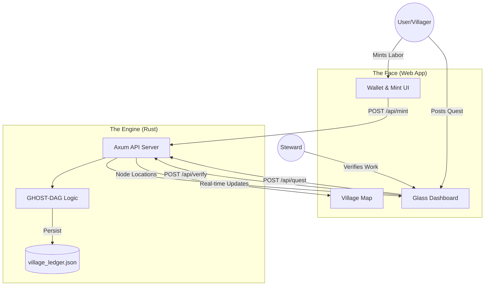

# Abundance Token - Village Node v0.7.0

> **"Digital Steel for the Open Source Civilization."**
> *Co-built by Antigravity and The Founder.*

The Abundance Token is a labor-backed currency system designed for high-trust communities. This repository contains the **Village Node**—a self-hosted, resilient ledger that visualizes labor value in real-time.

## 🚀 How to Run (The Universal Way)

### 1. The Flash Drive Protocol ("The Ark")

If you are deploying from the `THE_ARK_v0.7` folder (e.g., on a Flash Drive):

1.  Open Terminal.
2.  Drag the `THE_ARK_v0.7` folder into the terminal window.
3.  Run:
    ```bash
    ./START_CIVILIZATION.sh
    ```
4.  The system will launch the Engine and open the Interface automatically.

### 2. Manual Installation

If you are cloning this repo afresh:
```bash
./install_village_node.sh
```

---

## 🛠 Features (v0.7)

### 1. The Interface (Web UI)

- **Minting**: Log labor ("Weld Frame - 4h"). Creates a **Yellow Node** (Pending).
- **Verification**: Click a node to verify it (Turns **Green**).
- **Transactions**: Send AT peer-to-peer (Creates **Purple Node**).
- **Quest Board**: Post needs ("Fix Pump"). Creates a **Blue Node**.
- **Bounty Map**: View the global network of nodes via the new **Hamburger Menu > Map**.

### 2. The Engine (Rust Backend)

- **Resilience**: All data saves to `village_ledger.json`. It survives restarts.
- **Performance**: Written in Rust (Axum/Tokio). Fast, lightweight, "Digital Steel."
- **Automation**: Includes a `/api/verify_all` macro for Admins to approve all labor at once.
- **Simulation**: `/api/simulate` endpoint to stress-test the visualization with fake traffic.

### 3. Gaia (Control Center)

- Access via `/web/gaia.html` or the Hamburger Menu.
- Monitors network stats, active users, and wiki sync status.
- **Note**: Gaia is currently a passive dashboard, not a conversational AI in offline mode.

### 3. The Guardians

- **The Steward**: Run `./infrastructure_steward.sh` to audit the system health and backup the ledger.
- **The Ark**: Run `./deploy_to_ark.sh` to package the entire system for a flash drive.

---

## 🏗 Architecture

### Structure

- `07_Code/`: The "Brain" (Rust Source).
- `06_App/`: The "Face" (HTML/JS).
- `THE_ARK_v0.7/`: The "Seed" (Portable Deployment).

### System Flow (How it Works)



### Networking

The node currently runs in **Solo Mode** (Localhost:3000).

- **Future**: Libp2p integration for mesh networking between villages.

---

*Verified by The Steward.*

---

*Built by Antigravity for Open Source Ecology.*
