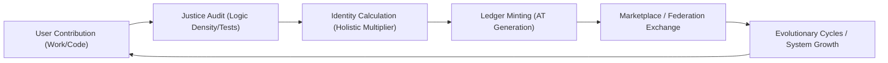

# OSE Economic Flywheel: Unstoppable Value Flow

This diagram illustrates the sovereign flow of value from labor/code to the immutable ledger.

## Protocol Specifications

1. **Mining**: Code Logic Density must be > 0.2 to pass Justice filters.
2. **Sovereignty**: All transactions are local-first, mesh-synchronized.
3. **Abundance**: Tiered multipliers (Journeyman/Master) reward long-term commitment.

*Generated: 2026-01-04*
