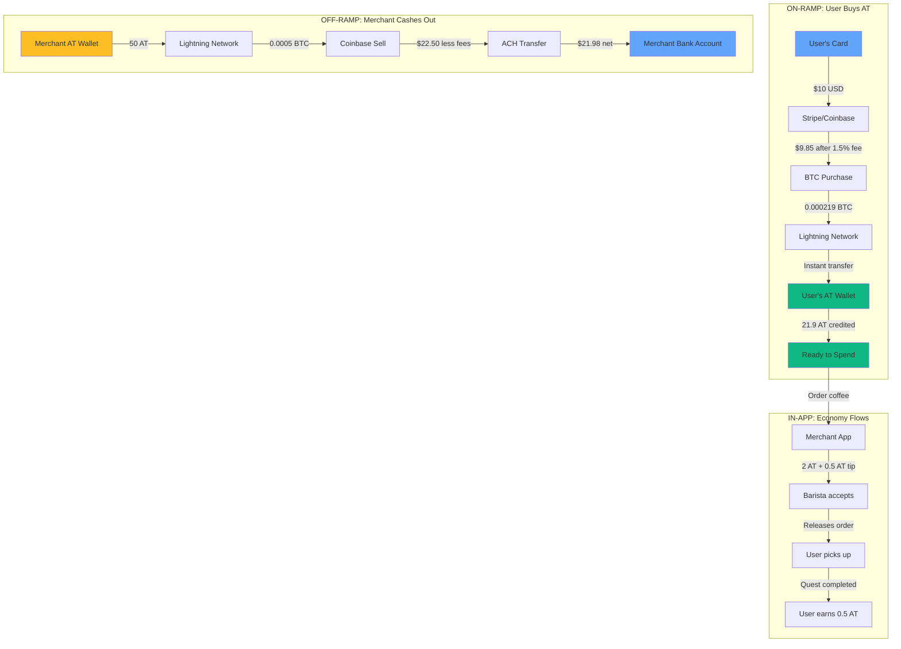
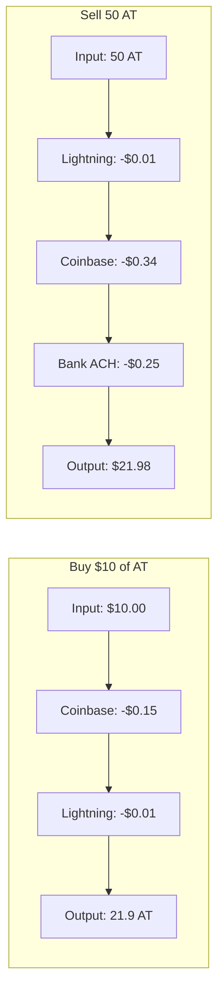
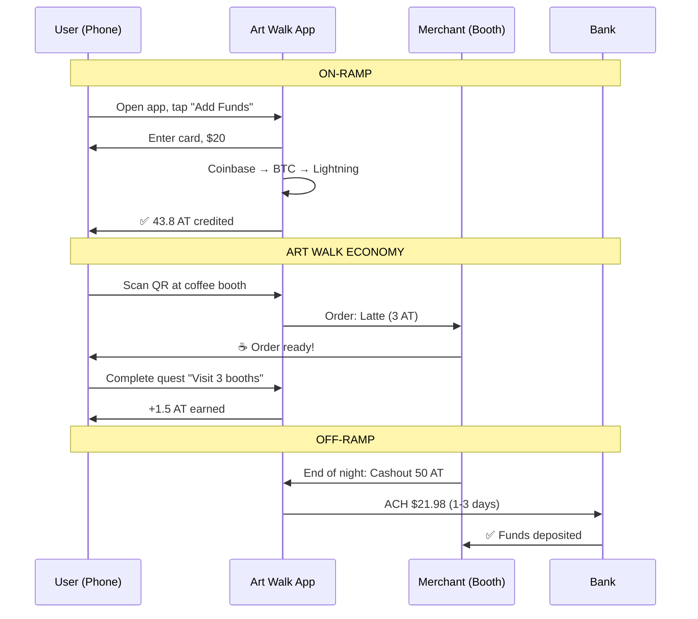

# MVP Complete Flow: Card → AT → Merchant → Bank

**Generated**: 2026-01-05  
**Context**: First Friday Art Walk Launch - Full fiat on/off ramp visualization

---

## The Complete Money Flow

---

## Fee Transparency (Not Hidden)

**Total Fees**: ~1.5% each way (compared to 2.9% + $0.30 for Stripe alone)

---

## First Friday User Journey

---

## Key Differentiators vs PayPal/Venmo

| Feature | AT System | PayPal/Venmo |
|---------|-----------|--------------|
| Merchant fees | ~1.5% | 2.9% + $0.30 |
| Instant transfer | ✅ Lightning | ❌ 1-3 days |
| User earns rewards | ✅ Quest system | ❌ No |
| Provenance tracking | ✅ Ledger | ❌ No |
| Central control | ❌ P2P | ✅ Can freeze |
| KYC required | ❌ Optional | ✅ Mandatory |

---

## What's Built

- ✅ `core/fiat_bridge.py` - Full on/off ramp logic
- ✅ `core/inventory.py` - Item tracking with provenance
- ✅ `core/quest_system.py` - Quest posting/claiming
- ✅ `core/triple_verification.py` - 3-Witness Protocol
- ✅ API endpoints for all flows

## What Jules Builds

- 📱 Mobile quest browser
- 🗺️ Merchant map with QR codes
- 📸 Photo proof upload (Phase 2)

## What You Execute

- 🤝 Kern Art Council partnership
- 👥 5-10 merchant recruitment
- 📄 Flyer design + printing
- 🎥 Demo video for socials

---

*The full loop is ready. Card in, AT flows, bank out. All transparent, all sovereign.*
