# Ark OS: Value Flow Diagram

**Generated via /linearmermaid workflow**

```mermaid
graph TD
    subgraph "User Journey"
        A["🧑 User (Bored)"] -->|Taps Screen| B["📺 The Mirror (Kiosk)"]
        B -->|Discovers| C["⚡ Quest Board"]
        C -->|Accepts| D["🎯 Quest (Labor/Social)"]
        D -->|Completes| E["✅ Triple Verification"]
        E -->|Earns| F["💰 AT Minted"]
    end

    subgraph "Merchant Journey"
        G["🏪 Merchant"] -->|Posts| H["📝 Quest (Need Help)"]
        H --> C
        G -->|Receives| I["👷 Free Labor"]
        I -->|Provides| J["🧾 Verification Stamp"]
        J --> E
    end

    subgraph "Economic Loop"
        F -->|Spends at| G
        G -->|Optional| K["💵 Fiat Bridge"]
        K -->|Converts| L["🏦 USD in Bank"]
    end

    subgraph "Perpetual Loop (AI)"
        M["🧠 Ollama (Right Brain)"] -->|Imagines| N["💡 Evolution Proposal"]
        N -->|Posts to| O["📊 Evolution API"]
        O -->|Reviewed by| P["👤 Human Architect"]
        P -->|Executes via| Q["🤖 Antigravity/Jules"]
        Q -->|Commits to| R["📦 GitHub"]
        R -->|Deploys to| S["🌐 Render"]
        S --> B
    end

    style A fill:#7C3AED,color:#fff
    style F fill:#10B981,color:#fff
    style G fill:#F59E0B,color:#000
    style M fill:#EF4444,color:#fff
```

## Nodes Explained

| Node | Description |
|------|-------------|
| **User (Bored)** | The target customer. They're bored, looking for something to do. |
| **The Mirror** | Physical kiosk (Raspberry Pi + Touch) deployed in merchant locations. |
| **Quest Board** | Live list of tasks/activities users can complete for AT. |
| **Triple Verification** | 3 witnesses confirm task completion (prevents fraud). |
| **AT Minted** | User receives Abundance Token for verified labor. |
| **Merchant** | Local business hosting the kiosk, posting quests. |
| **Free Labor** | Merchant gets help without paying cash. |
| **Fiat Bridge** | Optional: Merchant converts AT to USD. |
| **Ollama** | Local AI generating system upgrade ideas 24/7. |
| **Evolution API** | Backend endpoint receiving proposals from AI. |
| **Antigravity/Jules** | AI agents implementing approved proposals. |
| **Render** | Cloud deployment platform for production. |

---

*"This is the complete value loop: User boredom → Merchant help → AT minting → Spending → Fiat conversion (optional) → Repeat."*

# Building Mode Implementation Flow

**Generated via /linearmermaid workflow**

## Nodes Explained (Building Mode)

| Node | Description |
|------|-------------|
| **Research Rapier.js** | Selected Rust-based physics engine for performance. |
| **Fix Script Tags** | Resolved issue where JS was rendering as plain text. |
| **Grid Snapping** | Enforced 0.2m alignment for structural integrity. |
| **Component Library** | Added standard 2x4s, beams, and blocks. |
| **Functional Building Mode** | Final state: Physics-enabled construction tool. |

---
