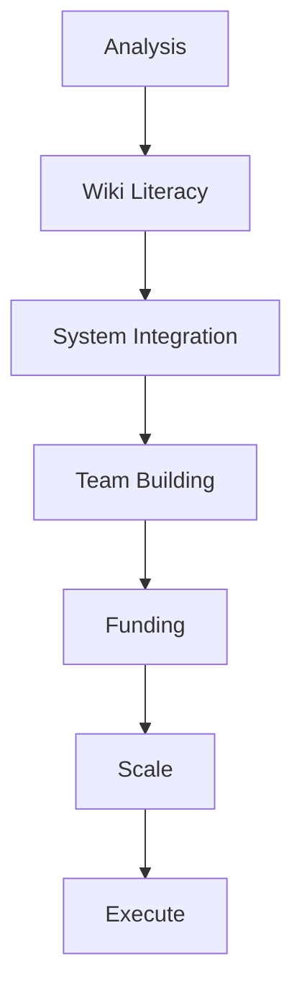

# Global Problemsolving Method Flow

## Nodes Explained (GPM)

| Node | Description |
|------|-------------|
| **Analysis** | Who is the best at Industry, Infrastructure, Architecture, Systems Standards? (Countries, Groups, Individuals). |
| **Wiki Literacy** | Cultivate collaborative literacy via investigative journalism. |
| **System Integration** | Open-source technical details to fill missing links. |
| **Team Building** | Establish Stewardship, Advisor, and Funder Contracts. |
| **Funding** | Cross-subsidize via robust earned revenue + scalable charitable funding. |
| **Scale** | Use resources to fund scalable Open Sector Enterprise. |
| **Execute** | Solutions for democracy, freedom, justice, prosperity. |