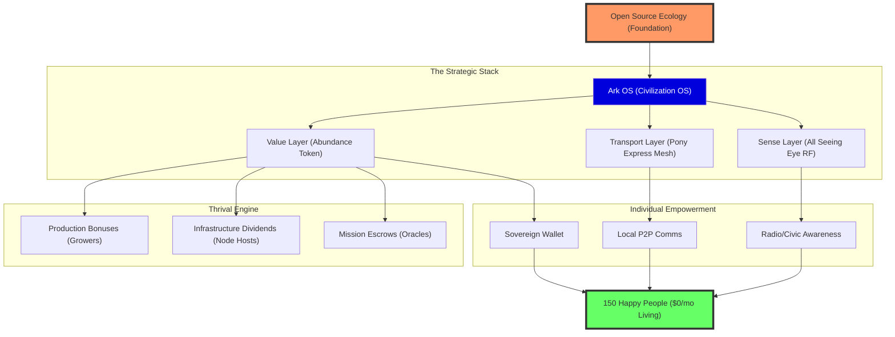

# OSE Civilization OS: Strategic Flow Map

### Key Nodes

- **OSE Foundation**: The core philosophy of modular, open-source hardware and self-sufficiency.
- **Ark OS**: The central brain coordinating energy, identity, and economics.
- **The Strategic Stack**:
  - **Sense**: Real-world awareness via RF and sensor monitoring.
  - **Transport**: Resilient, decentralized communication via mesh networking.
  - **Value**: Incentivizing thrival through the Abundance Token (AT).
- **Thrival Engine**: Automated rewards for those who build and maintain the community.
- **Sovereign Abundance**: The final state—a Type 6 civilization starting with Dunbar-scaled nodes of 150 people living for free.
