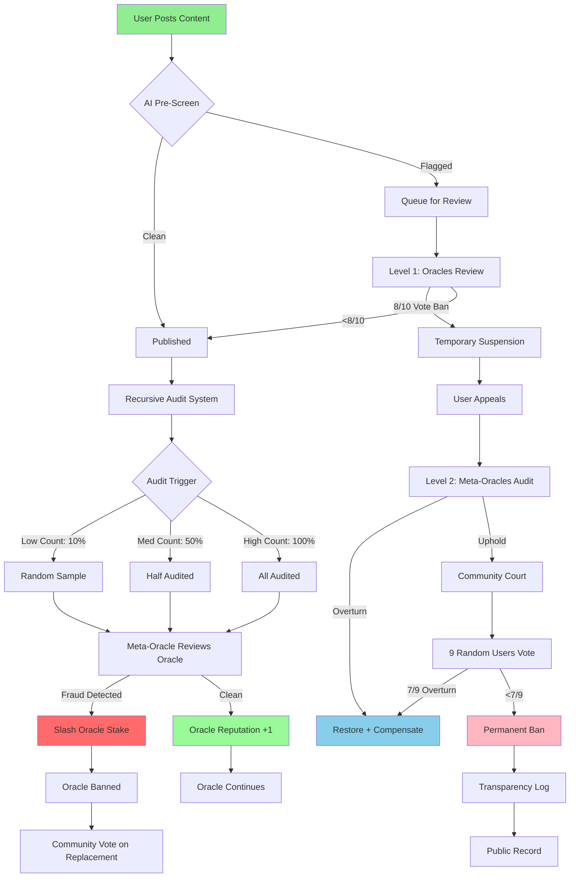

# Recursive Verification Flow

**Key Innovation:** Verify-to-Earn with Inverted Incentive

- **More power → More scrutiny**
- **Higher verification count → Higher audit frequency**
- **Prevents concentration → Forces distribution**

**Layers:**

1. Users (verified by Oracles)
2. Oracles (verified by Meta-Oracles)
3. Meta-Oracles (verified by Community)
4. Community (verified by Transparency)
5. Transparency (verified by Code)

**Exit at Every Level:**

- Disagree with ban → Appeal
- Disagree with appeal → Fork
- Disagree with node → Leave
- Disagree with network → Start new one

*"Trust is earned recursively. Power is checked automatically. Exit is always available."*
